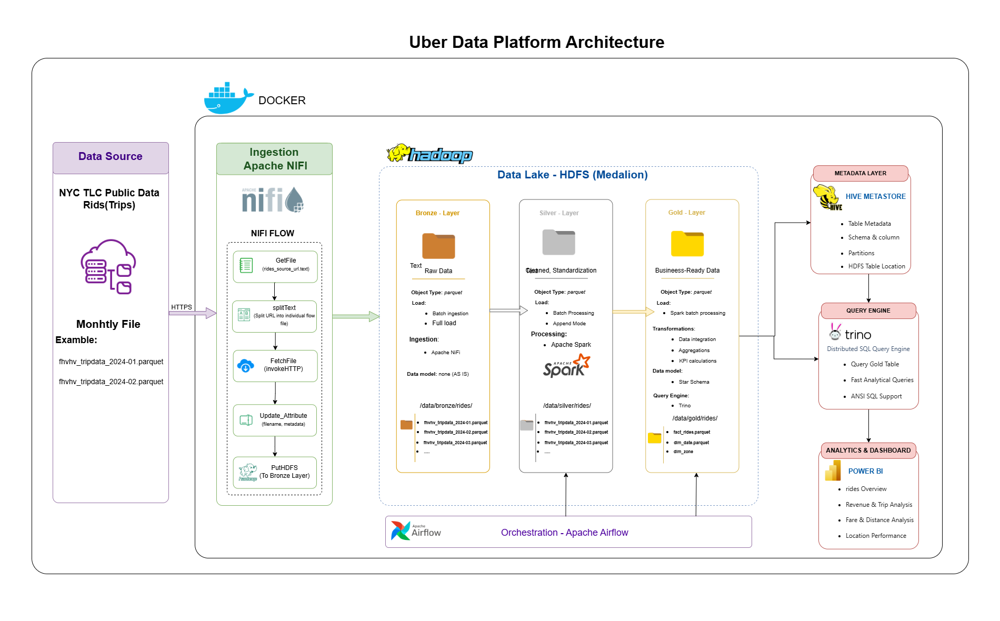
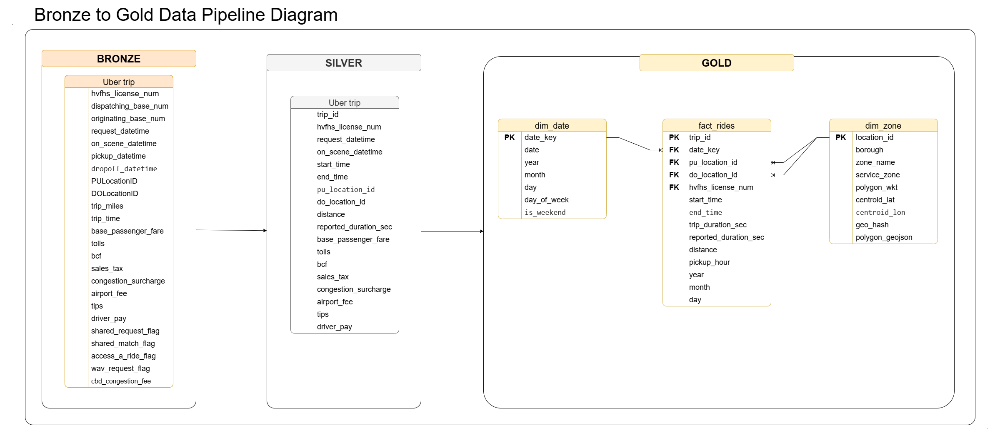
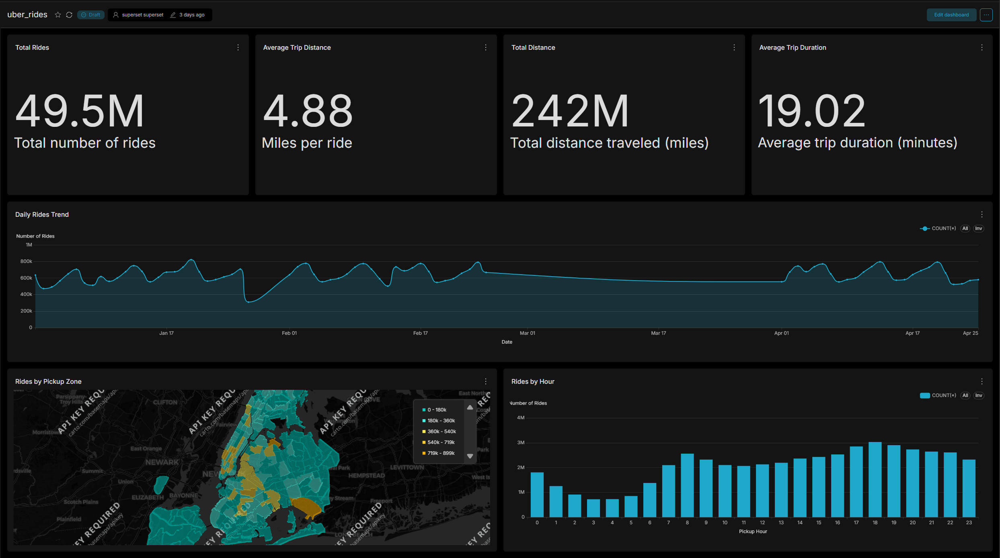

# Uber Data Platform: End-to-End Big Data Engineering Project

Welcome to the **Uber Data Platform** repository!  
This project demonstrates an end-to-end **Big Data Engineering and Analytics Platform** built to process large-scale ride-hailing data and transform raw trip records into clean, reliable, and analytics-ready data.

The platform follows a **Medallion Architecture (Bronze → Silver → Gold)** and combines data ingestion, distributed processing, data quality, orchestration, metadata management, SQL analytics, and visualization into one complete pipeline.

---

## 📖 Project Overview

This project was built to simulate a real-world **Data Engineering platform** for ride-hailing analytics.

The main objective was to take large volumes of raw trip data and transform them into business-ready datasets that can be queried and visualized efficiently.

### 🔹 Data Engineering Pipeline

1. **Bronze Layer**
   - Raw ride-hailing data ingestion.
   - Monthly NYC TLC High Volume For-Hire Vehicle (HVFHV) Parquet files.
   - Raw data is stored in HDFS without changing its original structure.

2. **Silver Layer**
   - Data cleaning and standardization.
   - Schema enforcement.
   - Null handling.
   - Data validation.
   - Deduplication.
   - Invalid records are moved to a quarantine layer.
   - Derived fields such as trip duration and date attributes are generated.

3. **Gold Layer**
   - Business-ready analytical data.
   - Kimball **Star Schema**.
   - Fact and dimension tables.
   - Partitioned fact table for better query performance.
   - Geospatial information added to taxi zones.

4. **Analytics & BI**
   - Trino provides distributed SQL access to the Gold Layer.
   - Apache Superset is used to build interactive dashboards and business insights.

---

## 🏗️ Data Architecture

The platform follows a complete data flow from raw ingestion to business intelligence:



### Pipeline Flow

```text
NYC TLC Data
     │
     ▼
Apache NiFi
     │
     ▼
HDFS - Bronze
     │
     ▼
Apache Spark
     │
     ▼
HDFS - Silver
     │
     ▼
Apache Spark
     │
     ▼
HDFS - Gold
     │
     ▼
Hive Metastore
     │
     ▼
Trino
     │
     ▼
Apache Superset
     │
     ▼
Analytics & Dashboards
```
---

## 🏛️ Data Modeling (Star Schema)

The Gold Layer uses a centralized **Fact Table** surrounded by **Dimension Tables**, following a Kimball **Star Schema** design optimized for analytical queries.



- **Fact Table**: `fact_rides` — Contains ride-level metrics and timestamps.
- **Dimension Tables**:
  - `dim_date` — Date and calendar attributes.
  - `dim_zone` — NYC taxi zone and geospatial information.

The grain of the `fact_rides` table is **one row per ride**, while the dimension tables provide descriptive context for analytical queries.

---

## 📊 Business Intelligence & Storytelling

The final output is an interactive **Apache Superset dashboard** designed to provide insights into ride demand, trip characteristics, service providers, and geographic distribution.



The dashboard includes:

- **Total Rides** — Overall number of rides.
- **Average Trip Distance** — Average distance per ride.
- **Average Trip Duration** — Average duration of rides.
- **Total Distance** — Total distance covered by all rides.
- **Daily Rides Trend** — Ride demand over time.
- **Rides by Hour** — Distribution of rides throughout the day.
- **Rides by Service Provider** — Comparison between ride-hailing providers.
- **Rides by Pickup Zone** — Geographic distribution of ride activity across NYC zones.

## 📂 Repository Structure

The project is organized into dedicated directories for data processing, orchestration, infrastructure, configuration, documentation, and testing.

```text
uber-data-platform/
│
├── airflow/                         # Airflow orchestration and DAG definitions
│   └── dags/                        # Pipeline workflow definitions
│
├── batch/                           # Batch data processing jobs
│
├── common/                          # Shared Spark utilities, schemas, and data models
│
├── config/                          # Configuration files for platform services
│   ├── hadoop/                      # Hadoop and HDFS configuration
│   ├── nifi/                        # Apache NiFi configuration
│   ├── superset/                    # Apache Superset configuration
│   └── trino/                       # Trino configuration
│       └── catalog/                 # Trino catalog definitions
│
├── data/                            # Local development and sample data
│   ├── generated/                   # Generated datasets
│   ├── raw/                         # Raw local data files
│   └── sample/                      # Small sample datasets for testing
│
├── docker/                          # Docker configurations for platform services
│   ├── airflow/                     # Airflow Docker configuration
│   ├── hadoop/                      # Hadoop Docker configuration
│   ├── hive/                        # Hive Metastore Docker configuration
│   ├── nifi/                        # NiFi Docker configuration
│   ├── spark/                       # Spark Docker configuration
│   │   └── notebooks/               # Spark notebooks and supporting files
│   └── superset/                    # Superset Docker configuration
│
├── docs/                            # Project documentation and visual assets
│   └── arcticture/                  # Architecture diagrams and screenshots
│
├── drivers/                         # External database drivers
│   └── postgresql-42.7.3.jar        # PostgreSQL JDBC driver
│
├── nifi/                            # NiFi ingestion resources and source files
│   ├── reference-source/            # Reference datasets for enrichment
│   ├── rides-source/                # Ride data source files and metadata
│   └── templates/                   # NiFi flow templates
│
├── scripts/                         # Supporting and utility scripts
│   └── postgres/                    # PostgreSQL initialization scripts
│
├── sql/                             # SQL scripts used across the platform
│   ├── hive_ddl/                    # Hive/Trino table definitions
│   └── trino_queries/               # Analytical SQL queries
│
├── tests/                            # Automated testing
│   ├── data_quality/                # Data quality and validation tests
│   ├── integration/                 # End-to-end integration tests
│   └── unit/                        # Unit tests
│
├── docker-compose.yml               # Multi-container platform definition
├── .gitignore                       # Files and directories excluded from Git
└── README.md                        # Project documentation and overview
```
## 🛡️ License
This project is licensed under the [MIT License](LICENSE). You are free to use, modify, and share this project with proper attribution.
---
